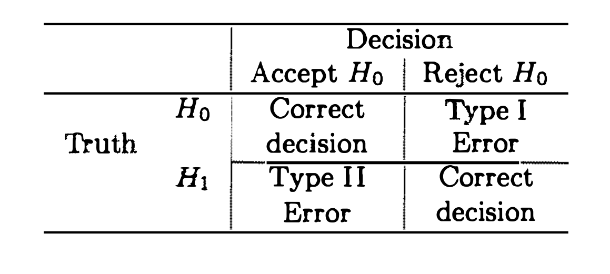
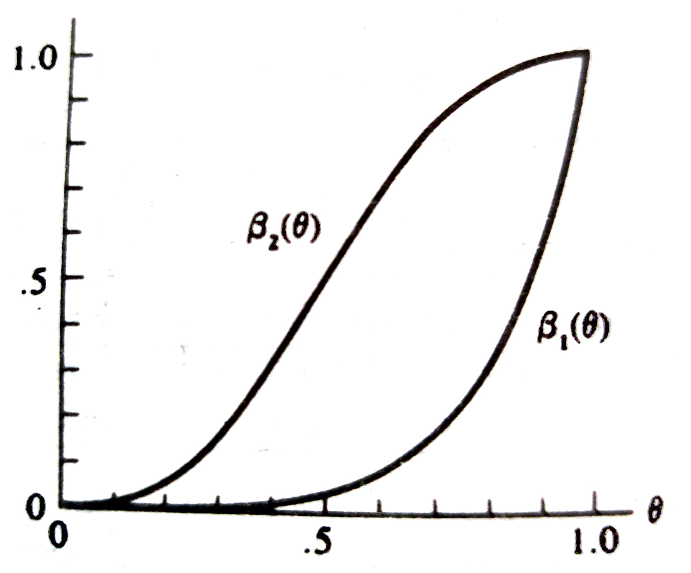

```{r setup, include=FALSE}
knitr::opts_chunk$set(echo = FALSE)
```


\newcommand{\rs}{X_1,X_2,\dots,X_n}
\newcommand{\on}{\operatorname}
\newcommand{\enter}{\vspace{0.1in}}
\newcommand{\ds}{\displaystyle}
\renewcommand{\bar}{\overline}
\newcommand{\N}{\text{N}}
\renewcommand{\epsilon}{\varepsilon}
\newcommand{\R}{\mathbb{R}}
\newcommand{\Ss}{\mathcal{S}}
\newcommand{\X}{\mathcal{X}}
\newcommand{\T}{\mathcal{T}}
\newcommand{\E}{\on{E}}
\newcommand{\var}{\on{Var}}
\newcommand{\cov}{\on{Cov}}
\newcommand{\MSE}{\on{MSE}}
\renewcommand{\vec}{\underline}
\newcommand{\asim}{\stackrel{a}{\sim}}
\renewcommand{\mathbf}{\vec}
<!-- \renewcommand{\mathcal}{\mathscr} -->


## AGENDA

\vspace{0.1in}


- Properties of tests, finding $c$ in LRT

\enter

- Methods of evaluating tests

\enter


- Neyman Pearson Lemma


# Review: likelihood ratio test


- Recall the \textbf{likelihood function} $\ds L(\theta\,|\,\mathbf{x}) = f(\mathbf{x}\,|\,\theta)=\prod_{i=1}^n{f(x_i\,|\,\theta)}.$
The \textbf{likelihood ratio test (LRT) statistic} for testing
$H_0 : \theta\in\Theta_0$ vs.  $H_1: \theta\in\Theta_0^c$ is
$\ds \lambda(\mathbf{x})=\frac{\sup_{\Theta_0}{L(\theta\,|\,\mathbf{x})}}{\sup_{\Theta}{L(\theta\,|\,\mathbf{x})}}.$

\enter

- Note that the likelihood ratio test statistic can be viewed as
$$\lambda(\mathbf{x})=\frac{L(\hat{\theta}_0\,|\,\mathbf{x})}{L(\hat{\theta}\,|\,\mathbf{x})}=\frac{\text{restricted maximization}}{\text{unrestricted maximization}},$$
where $\hat{\theta}$ is the MLE obtained by maximizing $L(\theta\,|\,\mathbf{x})$ over the entire parameter space $\Theta$, and $\hat{\theta}_0$ is the MLE obtained by maximizing over the restricted parameter space $\Theta_0$.

\enter


- A \textbf{likelihood ratio test (LRT)} is any test that has a rejection region of the form
$\lbrace\mathbf{x}\,:\,\lambda(\mathbf{x})\leq c\rbrace,$
where $c\in[0,1]$.


\enter

- Question: how to determine the threshold $c$? Heuristic idea: want a $c$ such that we won't, or at least very infrequently will, reject $H_0$ when it is in fact true, or not reject $H_0$ when it is in fact false.   


---

# Errors in Hypothesis Testing

**Definition:** Suppose we are testing
$$
\begin{aligned}
H_0 & : \theta\in\Theta_0\\[.5em]
\text{vs. } H_1 & : \theta\in\Theta_0^c.
\end{aligned}
$$

\enter

If $\theta\in\Theta_0$, but the test incorrectly rejects $H_0$, then the test has made a \textbf{Type I error}.

\enter

If, on the other hand, $\theta\in\Theta_0^c$, but the test decides to accept $H_0$, then the test has made a \textbf{Type II error}.

{height=30%}

---


# Computing Error Probabilities

**Definition:** Let $R$ denote the rejection region of a hypothesis test.
\vskip .2in
If $\theta\in\Theta_0$, then the probability of a Type I error is
$$P_{\theta}(\mathbf{X}\in R).$$
\vskip .2in
If $\theta\in\Theta_0^c$, then the probability of a Type II error is
$$P_{\theta}(\mathbf{X}\notin R)=1-P_{\theta}(\mathbf{X}\in R).$$


---

# Power Function

**Definition:** The \textbf{power function} of a hypothesis test with rejection region $R$ is the function of $\theta$ defined by
$$
\begin{aligned}
\beta(\theta) & = P_{\theta}(\mathbf{X}\in R)\\[.5em]
& = \begin{cases}\text{probability of a Type I error}&\text{if }\theta\in\Theta_0\\1-\text{ probability of a Type II error}&\text{if }\theta\in\Theta_0^c.\end{cases}
\end{aligned}
$$

**Comments on the Power function:**

(a) Ideally, we want $\beta(\theta)=0$ for all $\theta\in\Theta_0$ and $\beta(\theta)=1$ for all $\theta\in\Theta_0^c$.\vfill

(b) Depends on the hypothesis test (what are we testing?).\vfill

(c) Depends on the rejection region (value of $c$).\vfill

(d) It's a function of $\theta$, not the data.\vfill

(e) Since it's a probability, $0\leq\beta(\theta)\leq1$ for all $\theta$.


---


**Example:** Suppose $X\sim\operatorname{binomial}(5,\theta)$, and we are testing
$\ds H_0 : \theta\leq\frac{1}{2} \text{vs. } H_1  : \theta>\frac{1}{2}.$ Consider the two rejection regions
$$
\begin{aligned}
R_1 & = \lbrace x\,:\,x=5\rbrace\\[.5em]
R_2 & = \lbrace x\,:\,x=3,4,5\rbrace.
\end{aligned}
$$
Note that with $R_1$, we reject $H_0$ if and only if we observe all successes, whereas with $R_2$, we reject $H_0$ if and only if we observe at least $3$ successes. Determine the power function for each test.


\enter

Here
$$
\beta_1(\theta) = P_\theta(X \in R_1) = P_\theta(X = 5) = \binom{5}{5} \theta^5 (1-\theta)^{5-5} = \theta^5
$$
$$
\beta_2(\theta) = P_\theta(X \in R_2) = \sum_{j=3}^5 P_\theta(X = j) = \sum_{j=3}^5 \binom{5}{j} \theta^j (1-\theta)^{5-j}
$$


---

# Comments about the two power functions


{width=40%}


(a) $\beta_2(\theta)$ has higher Type I error and lower Type II error.

(b) $\beta_1(\theta)$ has lower Type I error and higher Type II error.

(c) Ideally, what we will do is try to maximize power while controlling Type I error.

(d) This is how we will choose $c$ in our previous calculations of rejection regions.

---

# Size and Level

**Definition:** For $0\leq\alpha\leq1$, a test with power function $\beta(\theta)$ is a \textbf{size $\alpha$ test} if
$$\sup_{\theta\in\Theta_0}{\beta(\theta)}=\alpha.$$
\vskip .2in
For $0\leq\alpha\leq1$, a test with power function $\beta(\theta)$ is a \textbf{level $\alpha$ test} if
$$\sup_{\theta\in\Theta_0}{\beta(\theta)}\leq\alpha.$$


\enter
\vfill
**Notes:** the set of size $\alpha$ tests is a subset of the set of level $\alpha$ tests.
\vfill
By specifying the level of a test, we are only controlling the Type I error, not the Type II error.


---

# Choosing $c$ For LRTs


- Restricting to size $\alpha$ tests allows us to determine the value of $c$ to use in the LRT.\vfill

- We can build a size $\alpha$ LRT by choosing $c$ so that
$$\sup_{\theta\in\Theta_0}{P_{\theta}(\mathbf{X}\in R)}=\alpha,\quad\text{i.e.,}\quad\sup_{\theta\in\Theta_0}{P_{\theta}(\lambda(\mathbf{X})\leq c)}=\alpha.$$

---

**Example (contd.):** Let $\rs\sim\operatorname{iid~N}(\theta,1)$. Suppose we wish to test
$H_0: \theta=\theta_0 \text{vs. } H_1 : \theta\neq\theta_0$.
We saw that the LRT rejection region is given by
$$R=\lbrace\mathbf{x}\,:\,|\overline{x}-\theta_0|\geq k\rbrace,$$
where $k=\sqrt{\frac{-2\log{c}}{n}}$. Find the value of $c$ so that we have a size $\alpha$ test.

Since $\Theta_0 = \{\theta_0\}$ is singleton, hence
$$
\on{size} = \sup_{\Theta_0} P_\theta\left(|\overline{X}-\theta_0|\geq k\right) = P_{\theta_0}\left(|\overline{X}-\theta_0|\geq k\right)
$$
Now, under $H_0$, $\bar X \sim N(\theta_0, 1/n)$ so that $Z = \sqrt{n}(\bar X - \theta_0) \sim N(0, 1)$. Therefore the size of the LRT being $\alpha$ implies
$$
\begin{aligned}
\alpha &= P_{\theta_0}\left(|\sqrt{n}(\bar X - \theta_0)| \geq \sqrt{n} \ k \right) \\
&= P_{\theta_0}(|Z| \geq \sqrt{n} \ k) \\
&= P(Z \geq \sqrt{n} \ k) + P(Z \leq -\sqrt{n} \ k) \\
&= P(Z \geq \sqrt{n} \ k) + P(-Z \geq  -\sqrt{n} \ k) = 2 \ P(Z \geq \sqrt{n} \ k)
\end{aligned}
$$
Let $z_{\alpha}$ be the upper $\alpha$-th quantile of $Z$ such that $P(Z \geq z_\alpha) = \alpha$.


---

Here $\alpha/2 = P(Z \geq \sqrt{n} \ k)$, which implies $$\sqrt{n} \ k = z_{\alpha/2} \implies k = \frac{1}{\sqrt{n}} z_{\alpha/2} \implies c = \exp\left(- z_{\alpha/2}^2 / 2\right)$$

\enter \vfill


**Example (contd.): ** Let $\rs\sim\operatorname{iid}$ from a location exponential population with pdf
$$f(x\,|\,\theta)=e^{-(x-\theta)}I_{[\theta,\infty)}(x).$$ Suppose we wish to test $H_0 : \theta\leq\theta_0$ vs. $H_1 : \theta>\theta_0$. We showed that the LRT rejection region is given by
$$R=\left\lbrace\mathbf{x}\,:\,x_{(1)}\geq\theta_0-\frac{\log{c}}{n}\right\rbrace.$$
Find the value of $c$ so that we have a size $\alpha$ test.

HW. See p. 386 in the textbook.

---

# Evaluating Tests

**Definition:** A test with power function $\beta(\theta)$ is \textbf{unbiased} if
$$\beta(\theta')\geq\beta(\theta'')$$
for every $\theta'\in\Theta_0^c$ and $\theta''\in\Theta_0$.

\enter
\vfill

**Definition:** Let $\mathcal{C}$ be a class of tests for testing $H_0 : \theta\in\Theta_0$ vs. $H_1 : \theta\in\Theta_0^c$. A test in class $\mathcal{C}$, with power function $\beta(\theta)$, is a \textbf{uniformly most powerful (UMP) class $\mathcal{C}$ test} if $\beta(\theta)\geq\beta'(\theta)$ for every $\theta\in\Theta_0^c$ and every $\beta'(\theta)$ that is a power function of a test in class $\mathcal{C}$.

\enter

**Note:** if we take $\mathcal{C}$ to be the class of all level $\alpha$ tests, the test described in the above definition is called a \textbf{UMP level $\alpha$ test}.

---


# Neyman-Pearson Lemma

## Theorem 8.3.12

\enter

Consider testing $H_0: \theta = \theta_0$ vs. $H_1: \theta=\theta_1$,
where

(1) the pdf or pmf corresponding to $\theta_i$ is $f(\mathbf{x}\,|\,\theta_i)$ for $i=0,1$;

(2) the test has a rejection region $R$ that satisfies

$\ds \mathbf{x}\in R\quad\text{if}\quad f(\mathbf{x}\,|\,\theta_1)>kf(\mathbf{x}\,|\,\theta_0)$
and
$\ds \mathbf{x}\in R^c\quad\text{if}\quad f(\mathbf{x}\,|\,\theta_1)<kf(\mathbf{x}\,|\,\theta_0)$
for some $k\geq0$; and

(3) $\alpha=P_{\theta_0}(\mathbf{X}\in R)$.

\enter 

Then 

\enter 

(a) **(Sufficiency)** any test that satisfies (2) and (3) above is a UMP level $\alpha$ test; and

(b) **(Necessity)** if there exists a test satisfying (2) and (3) above with $k>0$, then every UMP level $\alpha$ test is a size $\alpha$ test (satisfies (3) above), and every UMP level $\alpha$ test satisfies (2) above, except perhaps on a set $A$ satisfying
$\ds P_{\theta_0}(\mathbf{X}\in A)=P_{\theta_1}(\mathbf{X}\in A)=0.$


<!-- --- -->

<!-- **Proof:** Assume that $f(\mathbf{x}\,|\,\theta_0)$ and $f(\mathbf{x}\,|\,\theta_1)$ are pdfs of continuous random variables. -->


<!-- Note  that any test satisfying (3) is a size $\alpha$ and, hence, a level $\alpha$ test: -->
<!-- $$ -->
<!-- \sup_{\theta \in \Theta_0} P_\theta(\vec X \in R) = P_{\theta_0} (\vec X  \in R) = 0 -->
<!-- $$ -->
<!-- Consider the *test function* $\phi(\vec x) = I(\vec x \in R)$ of a test satisfying (1) and (2).  -->


<!-- \enter -->

<!-- **Part(a):** Let $\phi'(\vec x)$ be the test function of any other level $\alpha$ test, and let $\beta(\theta)$ and $\beta'(\theta)$ be the power -->
<!-- functions for the tests $\phi$ and $\phi'$, respectively.  -->

<!-- Now consider quantity $\psi(\vec x \mid \theta_0, \theta_1) =  (\phi(\vec x) - \phi'(\vec x)) \ (f(\mathbf{x}\,|\,\theta_1) - kf(\mathbf{x}\,|\,\theta_0))$. -->

<!-- \enter -->

<!-- Then $\psi(\vec x \mid \theta_0, \theta_1) \geq 0$ for all $\vec x$ (since $0 \leq \phi'(\vec x) \leq 1$ for all $x$ and $\phi(\vec x) = I(\vec x \in R)$) -->

<!-- $$ -->
<!-- \begin{aligned} -->
<!-- \implies 0 \ & \leq \int \left[(\phi(\vec x) - \phi'(\vec x)) \ (f(\mathbf{x}\,|\,\theta_1) - kf(\mathbf{x}\,|\,\theta_0))\right] \ d\vec x \\ -->
<!-- & = \beta(\theta_1) - \beta'(\theta_1) - k (\beta(\theta_0) - \beta'(\theta_0)) && (\star) -->
<!-- \end{aligned} -->
<!-- $$ -->

<!-- --- -->

<!-- Since $\phi'(\vec x)$ is a level $\alpha$ test and $\phi(\vec x)$ is a size $\alpha$ test, therefore $\beta(\theta_0) - \beta'(\theta_0) \geq \alpha - \alpha = 0$. Therefore from $(\star)$, -->
<!-- $$ -->
<!-- 0 \leq \beta(\theta_1) - \beta'(\theta_1) - k (\beta(\theta_0) - \beta'(\theta_0)) \leq \beta(\theta_1) - \beta'(\theta_1) -->
<!-- $$ -->
<!-- implying $\beta(\theta_1) \geq \beta'(\theta_1)$. This proves part (a). -->

<!-- \enter -->


<!-- **Part(b):** let $\phi'$ now be the test function for any UMP level $\alpha$ test. By part (a), $\phi$, a test satisfying (2) and (3) above, is also a UMP level $\alpha$ test, thus $\beta(\theta_1) = \beta'(\theta_1)$. Since $k \geq 0$, from $(\star)$ -->
<!-- $$ -->
<!-- 0 \leq 0 - k (\beta(\theta_0) - \beta'(\theta_0)) \implies \underbrace{\beta(\theta_0)}_{=\alpha} - \beta'(\theta_0) \leq 0 \implies \beta'(\theta_0) \geq \alpha -->
<!-- $$ -->
<!-- but by assumption $\phi'(\vec x)$ is a level $\alpha$ test, i.e., $\beta'(\theta_0) \leq \alpha$, which together imply $\beta'(\theta_0) = \alpha$ meaning $\phi'(\vec x)$ is a size $\alpha$ test, and $(\star)$ is an equality. -->

<!-- \enter -->

<!-- However, the non-negative integrand $\psi(\vec x \mid \theta_0, \theta_1)$ will have a zero integral only if it satisfies -->
<!-- (2), except perhaps on a set $A$ satisfying -->
<!-- $\ds P_{\theta_0}(\mathbf{X}\in A)=P_{\theta_1}(\mathbf{X}\in A)=0.$ This proves (b).  -->

<!-- --- -->


# Tests Based on Sufficient Statistics


## Corollary 8.3.13

\enter

Consider testing $H_0:\theta=\theta_0$ vs. $H_1:\theta=\theta_1$. Suppose $T(\mathbf{X})$ is a sufficient statistic for $\theta$, and let $g(t\,|\,\theta_i)$ be the pdf or pmf of $T$ corresponding to $\theta_i$ for $i=0,1$. Then any test based on $T$ with rejection region $S$ (a subset of the sample space of $T$) is a UMP level $\alpha$ test if it satisfies

\enter

(1) for some $k\geq0$, $$t\in S\quad\text{if}\quad g(t\,|\,\theta_1)>kg(t\,|\,\theta_0)$$
and
$$t\in S^c\quad\text{if}\quad g(t\,|\,\theta_1)<kg(t\,|\,\theta_0)$$
and

\enter

(2) $\alpha=P_{\theta_0}(T\in S)$.


\enter \vfill

**Proof:** Use factorization theorem. Reading exercise. See p. 390 in the textbook.

---

**Example:** Suppose $X\sim\operatorname{binomial}(2,\theta)$, and we are testing
$H_0: \theta=\frac{1}{2}$ vs. $H_1: \theta=\frac{3}{4}$. Determine the UMP level $\alpha$ tests for $\alpha=0,\frac{1}{4},\frac{3}{4},1$.


\enter

At the outset note that a "larger" value of $X$ favors $H_1$, and a smaller value of $X$ favors $H_0$.

\enter

We have $\ds f(x \mid \theta) = \binom{2}{x} \ \theta^x \ (1-\theta)^{2-x}; \ x = 0, 1, 2$. Consider the ratio
$$
\frac{f\left(x \mid \theta=\frac{3}{4}\right)}{f\left(x \mid \theta=\frac{1}{2}\right)} = \frac{\binom{2}{x} \ \left(\frac34\right)^x \ \left(\frac14\right)^{2-x}}{\binom{2}{x} \ \left(\frac12\right)^x \ \left(\frac12\right)^{2-x}} = \left(\frac32\right)^x \ \left(\frac12\right)^{2-x}; \quad x = 0, 1, 2
$$
Therefore,
$$
\frac{f\left(0 \mid \theta=\frac{3}{4}\right)}{f\left(0 \mid \theta=\frac{1}{2}\right)} = \frac14; \quad \frac{f\left(1 \mid \theta=\frac{3}{4}\right)}{f\left(1 \mid \theta=\frac{1}{2}\right)} = \frac34; \quad \frac{f\left(2 \mid \theta=\frac{3}{4}\right)}{f\left(2 \mid \theta=\frac{1}{2}\right)} = \frac94.
$$


---


(a) If we choose $\frac34 < k < \frac94$ then NP Lemma says that the test that rejects $H_0$ if $X = 2$ is the UMP level $\alpha = P\left(X = 2 \mid \theta = \frac12 \right) = \frac14$ test. 


(b) If we choose $\frac14 < k < \frac34$
then NP Lemma says that the test that rejects $H_0$ if $X = 1$ or $X = 2$ is the UMP level $\alpha = P\left(X = 1 \text{ or }  2 \mid \theta = \frac12 \right) = \frac34$ test

(c) Choosing $k < \frac14$ or $k > \frac94$ produces UMP level 1 or level 0 tests tests respectively.

\vfill


- If $k = \frac34$, NP lemma says that we must reject $H_0$ when $X = 2$
and accept $H_0$ but leaves the action for $X = 1$ undetermined. 

  --  If we accept $H_0$ for $X = 1$, we get the UMP level $\alpha = \frac14$  test as above (case (a)). 
 
  -- If we reject $H_0$ for $X = 1$, we get the UMP level $\alpha = \frac34$  test as above (case (b)).


---


<!-- **Example:** Suppose that $X_1,X_2,X_3,X_4\sim\operatorname{iid~gamma}(3,\theta)$ is a random sample to be used to test the hypotheses $H_0: \theta=\theta_0$ $H_1: \theta=\theta_1$, where $\theta_1>\theta_0$. Use the Neyman-Pearson Lemma to find the most powerful critical region of size $\alpha$. -->

**Example (UMP Normal test):** 
Let $\rs \sim \on{iid} N(\theta, \sigma^2)$ population, $\sigma^2$ known. Consider testing $H_0 : \theta = \theta_0$ vs. $H_1 : \theta = \theta_1$ , where $\theta_0 > \theta_1$. Find the UMP test.

\enter

The sample mean $\bar X$ is a sufficient statistic for $\theta$. So we'll use the corollary of NP lemma with sufficient statistic. 

\enter

Here
$$g(\bar x \mid \theta_1) > k \ g(\bar x \mid \theta_0)$$ 
is equivalent to (HW, use $\theta_1 - \theta_0 < 0$)
$$
\bar x < \frac{\frac{2 \sigma^2 \log k}{n} - (\theta_0^2 - \theta_1^2)}{2(\theta_1 - \theta_0)}
$$
i.e., of the form $\bar x < c$. Therefore, by the (corollary to) the NP lemma, a test that rejects $H_0$ when $\bar x < c$ is a UMP size $\alpha$ test, where $c$ is obtained from 
$$
\alpha = P_{\theta_0}(\bar X < c) = P_{\theta_0}\left( \frac{\bar X - \theta_0}{\sigma/\sqrt{n}} < \frac{c- \theta_0}{\sigma/\sqrt{n}} \right) \implies \frac{c- \theta_0}{\sigma/\sqrt{n}} = z_{1-\alpha} = -z_{\alpha}
$$  
i.e., $c = \theta_0 - z_\alpha \frac{\sigma}{\sqrt n}$


---

## Comments:

\enter
- NP lemma can handle only tests with a point null against a point alternative


\enter
- Question: can we say something similar more general hypothesis tests?


\enter
- Answer: Yes, to some extent. Will need monotone likelihood ratio & Karlin-Rubin theorem. Next week..

<!-- # Homework -->

<!-- -   Read p. $374-379$, $382-387$. -->

<!-- -   Exercises: TBA. -->

