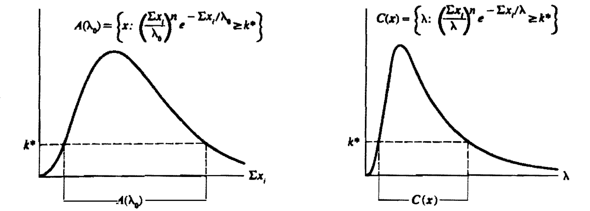

```{r setup, include=FALSE}
knitr::opts_chunk$set(echo = FALSE)
```


\newcommand{\rs}{X_1,X_2,\dots,X_n}
\newcommand{\on}{\operatorname}
\newcommand{\enter}{\vspace{0.1in}}
\newcommand{\ds}{\displaystyle}
\renewcommand{\bar}{\overline}
\newcommand{\N}{\text{N}}
\renewcommand{\epsilon}{\varepsilon}
\newcommand{\R}{\mathbb{R}}
\newcommand{\Ss}{\mathcal{S}}
\newcommand{\X}{\mathcal{X}}
\newcommand{\T}{\mathcal{T}}
\newcommand{\E}{\on{E}}
\newcommand{\var}{\on{Var}}
\newcommand{\cov}{\on{Cov}}
\newcommand{\MSE}{\on{MSE}}
\renewcommand{\vec}{\underline}
\newcommand{\asim}{\stackrel{a}{\sim}}
\renewcommand{\mathbf}{\vec}
<!-- \renewcommand{\mathcal}{\mathscr} -->


# AGENDA

\vspace{0.1in}

- Interval Estimation

\vspace{0.1in}

- non-existence of UMP tests

\enter

- Interval Estimation

\enter

- Method of Finding Interval Estimates


---


# Review: Interval Estimation

- An \textbf{interval estimate} of a real-valued parameter $\theta$ is any pair of functions, $L(\mathbf{x})$ and $U(\mathbf{x})$, of a sample that satisfy $L(\mathbf{x})\leq U(\mathbf{x})$ for all $\mathbf{x}\in\mathcal{X}$.

- For an interval estimator $[L(\mathbf{X}),U(\mathbf{X})]$ of a parameter $\theta$, the \textbf{coverage probability} of $[L(\mathbf{X}),U(\mathbf{X})]$ is the probability that the random interval $[L(\mathbf{X}),U(\mathbf{X})]$ covers the true parameter $\theta$. 

- For an interval estimator $[L(\mathbf{X}),U(\mathbf{X})]$ of a parameter $\theta$, the \textbf{confidence coefficient} of $[L(\mathbf{X}),U(\mathbf{X})]$ is the infimum of the coverage probabilities,
$\inf_{\theta}{P_{\theta}\left(\theta\in [L(\mathbf{X}),U(\mathbf{X})]\right)}$.
We use \textbf{confidence interval} to mean the interval estimator along with its corresponding confidence coefficient.


---

# Review: Interval Estimation

- Methods of finding interval estimators: (a) Invert a test statistic, (b) Use pivotal quantities.

- In general, every confidence interval corresponds to a test, and vice versa. Begin with the acceptance region of a hypothesis test and invert to obtain a confidence interval.


- We considered inversion of a two-sided normal hypothesis test

---

# Correspondence between hypothesis tests and confidence interval

## Theorem 9.2.2

For each $\theta_0 \in \Theta$, let $A(\theta_0)$ be the acceptance region of a level $\alpha$ test of $H_0 : \theta = \theta_0$, For each $\vec x \in \mathcal{X}$, define a set $C(\vec x)$ in the parameter space by
$$
C(\vec x) = \{\theta_0 : \vec x \in A(\theta_0)\}
$$
Then the random set $C(\vec X)$ is a $1 - \alpha$ confidence set. Conversely, let $C(\vec X)$ be a $1 - \alpha$ confidence set. For any $\theta_0 \in \Theta$, define
$$
A (\theta_0) = \{\vec x: \theta_0   \in C(\vec X)\}
$$
Then $A (\theta_0)$ is the acceptance region of alevel $\alpha$ test of $H_0 : \theta = \theta_0$.


---

**Proof:** For the first part, since $A(\theta_0)$ is the acceptance region of a level $\alpha$ test,
$$
P_{\theta_0} (\vec X \not \in A(\theta_0)) \leq \alpha \implies \ P_{\theta_0} (\vec X \in A(\theta_0)) \geq 1- \alpha
$$
Since $\theta_0$ is arbitrary write $\theta$ instead of $\theta_0$, so that  
$$
P_{\theta} (\theta \in C(\vec X)) = P_{\theta} (\vec X \in A(\theta)) \geq 1- \alpha
$$
which implies that $C(\vec X)$ is a $1 - \alpha$ confidence set.

\enter \vfill

For the second part, observe that 
$$
P_{\theta_0} (\vec X \not \in A(\theta_0)) = P_{\theta_0} (\theta \not \in C(\vec X)) \leq \alpha
$$
since $C(\vec X)$ is a $1-\alpha$ confidence set. This shows that $A(\theta_0)$ is the acceptance region of a level $\alpha$ test.

---

## Remark: Confidence sets vs. intervals

- Note that by inverting a test we get confidence sets, and not necessarily confidence intervals.

\enter \vfill

- In most cases, one-sided tests give one-sided
intervals, two-sided tests give two-sided intervals, and strange-shaped acceptance regions
give strange-shaped confidence sets.


---

**Example: (Inverting an LRT)** Suppose $\rs \sim \on{iid~Exponential}(\lambda)$. Construct a $1-\alpha$ confidence set for $\lambda$.

\enter \vfill

Consider the test $H_0: \lambda = \lambda_0$ vs. $\lambda \neq \lambda_0$. 

\enter

The unrestricted MLE of $\lambda$ is $\hat \lambda = \frac{1}{n} \sum_{i=1}^n X_i = \bar X$.

\enter

The LR statistic is given by
$$
\begin{aligned}
\frac{L(\lambda_0 \mid \vec x)}{\sup_{\Theta} L(\lambda \mid \vec x)}  
&= \frac{\frac{1}{\lambda_0^n} \ \exp \left(-\sum_{i=1}^n x_i/\lambda_0 \right) }{\sup_{\lambda > 0} \frac{1}{\lambda^n} \ \exp \left(-\sum_{i=1}^n x_i/\lambda \right)} \\ 
&= \frac{\frac{1}{\lambda_0^n} \ \exp \left(-\sum_{i=1}^n x_i/\lambda_0 \right) }{ \frac{1}{{\bar x}^n} \ \exp \left(-\sum_{i=1}^n x_i/{\bar x} \right)} \\
&= \left(\frac{\sum_{i=1}^n x_i}{\lambda_0}\right)^n e^n \ e^{-\sum_{i=1}^n x_i/\lambda_0}
\end{aligned}
$$

---

For fixed $\lambda_0$, the acceptance region of the LR test is given by:
$$
A(\lambda_0) = \left\{ \vec x: \left(\frac{\sum_{i=1}^n x_i}{\lambda_0}\right)^n  e^{-\sum_{i=1}^n x_i/\lambda_0} \geq k^*  \right\}
$$
where $k^*$ is a constant chosen to satisfy $P_{\lambda_0}(\vec X \in A(\lambda_0)) = 1-\alpha$. Inverting this acceptance region gives the following $1-\alpha$ confidence set:
$$
C(\vec x) = \left\{ \lambda: \left(\frac{\sum_{i=1}^n x_i}{\lambda}\right)^n  e^{-\sum_{i=1}^n x_i/\lambda} \geq k^*  \right\}
$$




---

Note that $C(\vec x)$ depends on $\vec x$ only through $\sum_{i=1}^n x_i$. So the confidence set can be expressed in the form:
$$
C\left(\sum_{i=1}^n x_i\right) =  \left\{ \lambda: L\left(\sum_{i=1}^n x_i\right) \leq \lambda \leq U\left(\sum_{i=1}^n x_i\right)  \right\}
$$
where $L = L(\sum_{i=1}^n x_i)$ and $U = U(\sum_{i=1}^n x_i)$ are functions such that $P_{\lambda_0}(\vec X \in A(\lambda_0)) = 1-\alpha$ and
$$
\left(\frac{\sum_{i=1}^n x_i}{L}\right)^n  e^{-\sum_{i=1}^n x_i/L} = \left(\frac{\sum_{i=1}^n x_i}{U}\right)^n  e^{-\sum_{i=1}^n x_i/U} 
$$
Call $\frac{\sum_{i=1}^n x_i}{L} = a$ and $\frac{\sum_{i=1}^n x_i}{U} = b$ with $a > b$, then the above equation becomes 
$a^n e^{-a} = b^n e^{-b}$. Thus a $1-\alpha$ confidence interval becomes
$\left\{ \lambda: \frac{1}{a} \sum_{i=1}^n X_i \leq \lambda \leq \frac{1}{b}\sum_{i=1}^n X_i  \right\}$, where $a$ and $b$ satisfy:

(1) $\ds P_\lambda\left(\frac{1}{a} \sum_{i=1}^n X_i \leq \lambda \leq \frac{1}{b}\sum_{i=1}^n X_i\right) = P_\lambda\left(b \leq \frac{\sum_{i=1}^n X_i}{\lambda} \leq a \right) = 1-\alpha$

(2) $\ds a^n e^{-a} = b^n e^{-b}$


---


**Example: (Normal one-sided confidence bound)** $\rs \sim \on{iid~N}(\mu, \sigma^2)$. Consider constructing a $1 - \alpha$ upper
confidence bound for $\mu$, i.e., we want a confidence interval of the form $C(x) = (-\infty, U(\vec x)]$.

\enter

To obtain such an interval we'll consider the one sided tests $H_0: \mu = \mu_0$ vs. $H_1: \mu < \mu_0$.

\enter 

[Note $H_1: \mu < \mu_0$ specifies "large values" of $\mu$, so the confidence interval, which is obtained from inverting the acceptance region (favorable to $H_0$) will contain "small" values of $\mu$].

\enter

The size $\alpha$ LRT of $H_0$ versus $H_1$ rejects $H_0$ if 
$$
\frac{\bar X - \mu_0}{S/\sqrt{n}} < -t_{n-1, \alpha}
$$

---


The acceptance region of the test is 
$$
A(\mu_0) = \left\{ \vec x: \bar x \geq \mu_0 - t_{n-1, \alpha} \frac{s}{\sqrt{n}}\right\}
$$
Inverting we get the following confidence interval:
$$
\begin{aligned}
C(\vec x) &= \left\{ \mu_0: \vec x \in A(\mu_0) \right\} \\
&= \left\{\mu_0: \mu_0 \leq \bar x +  t_{n-1, \alpha} \frac{s}{\sqrt{n}} \right\} \\
&\equiv \left( -\infty, \bar x +  t_{n-1, \alpha} \frac{s}{\sqrt{n}} \right]
\end{aligned}
$$


---


# Pivotal Quantities

**Definition:** A random variable $Q(\mathbf{X},\theta)$ is a \textbf{pivotal quantity} (or \textbf{pivot}) if and only if the distribution of $Q(\mathbf{X},\theta)$ is independent of all parameters. That is, if $\mathbf{X}\sim F(\mathbf{x}\,|\,\theta)$, then $Q(\mathbf{X},\theta)$ has the same distribution for all values of $\theta$.


\enter \vfill

- The function $Q(\mathbf{X},\theta)$ will usually explicitly contain both parameters and statistics,
but for any set $\mathcal{A}$, $P_\theta(Q(\mathbf{X},\theta) \in \mathcal{A})$ cannot depend on $\theta$. 


- The technique of constructing
confidence sets from pivots relies on being able to find a pivot and a set $\mathcal{A}$
the set $\{\theta : Q(\mathbf{X},\theta) \in \mathcal{A}\}$ is a set estimate of $\theta$.

---

# Examples of Pivotal Quantities

(a) If $\overline{X}$ is the mean of a random sample of size $n$ from a normal population with mean $\mu$ and variance $\sigma^2$, then
$$Y=\overline{X}-\mu\quad\text{and}\quad Z=\frac{\overline{X}-\mu}{\sigma/\sqrt{n}}$$
are pivotal quantities.\vfill


(b) If $\overline{X}$ and $S^2$ are the mean and variance of a random sample of size $n$ from a normal population with mean $\mu$ and variance $\sigma^2$, then
$$\frac{(n-1)S^2}{\sigma^2}\sim\chi_{n-1}^2\quad\text{and}\quad T=\frac{\overline{X}-\mu}{S/\sqrt{n}}\sim t_{n-1}$$
are pivotal quantities.


---

(c) If $\rs\sim\operatorname{iid~Gamma}(1,\beta) \equiv \on{Exponential}(\beta)$, then
$$Y=\frac{2}{\beta}\sum_{i=1}^n{X_i}\sim\chi_{2n}^2 \equiv \on{Gamma}(n, 2)$$
is a pivotal quantity.

\enter

**Proof:** Homework. Use mgf.

\enter \vfill


(d) If $\rs\sim\operatorname{iid~uniform}(0,\theta)$ and $Y_n=X_{(n)}$, then
$$T_n = \frac{Y_n}{\theta}$$
is a pivotal quantity.

\enter 
**Proof:** The cdf of $T_n$ is 
$$
F_{T_n}(t) = P(T_n \leq t) = P(Y_n \leq t\theta) = \{F_X(t\theta)\}^n = t^n \ I(0 \leq t \leq 1)
$$

---


(e) **Pivotal quantities for Location-Scale families.** Suppose $\rs$ is a random sample from a family of pdfs $f$. Then  (i) If $f$ is a location family of the form $f(x - \mu)$ then $\bar X - \mu$ is a pivotal quantity. (ii) If $f$ is a scale family of the form $\frac{1}{\sigma}f\left(\frac{x}{\sigma}\right)$, then $\bar X/\sigma$ is a pivotal quantity. (iii) If $f$ is a location-scale family of the form $\frac{1}{\sigma}f\left(\frac{x - \mu}{\sigma}\right)$ then $\frac{(\bar X-\mu)}{S_X}$ is a pivotal quantity.


\vfill

**Proof:** (i), (ii) homework. For (iii) consider the standard member $f(z)$ of the family, and let $Z_1, \dots, Z_n \sim \on{iid}f(z)$ such that $X_i = \mu + \sigma Z_i$.  We have
$$
\frac{(\bar X-\mu)}{S_X} = \frac{(\mu + \sigma \bar Z-\mu)}{S_{\mu + \sigma Z}} = \frac{\sigma \bar Z}{\sigma S_{Z}} = \frac{\bar Z}{S_{Z}}  
$$
whose distribution is free of $\mu, \sigma$ as the common pdf $f(z)$ of $Z_i$ is free of $\mu$ and $\sigma$.

---

# Checking if a pivot exists

## Theorem

Suppose that $T$ is a real-valued statistic. Suppose that $Q(t, \theta)$ is a monotone function of $t$ for each value of $\theta \in  \Theta$. If the pdf $f(t \mid \theta)$ of $T$ can be written in the form
$$
f(t \mid \theta) = g(Q(t, \theta)) \left| \frac{\partial}{\partial t} Q(t, \theta) \right|
$$
for some function $g$, then $T$ is a pivot.

\enter \vfill

**Proof:** Homework. (Problem 9.10a).


---

# The Pivotal Method of Finding Confidence Sets

## Theorem

To construct a $(1-\alpha)100\%$ confidence interval for $\theta$:
\vskip .2in
\textbf{Step $1$}:  Find a pivotal quantity $Q$ that is a monotone function of $\theta$.
\vskip .2in
\textbf{Step $2$}:  Find $l$ and $u$ such that
$$P_{\theta}(l<Q<u)=1-\alpha.$$
Note that there are an infinite number of solutions, hence we will use the equal-tails confidence interval by letting $l=100\left(\frac{\alpha}{2}\right)$ percentile of $Q$ and $u=100\left(1-\frac{\alpha}{2}\right)$ percentile of $Q$.
\vskip .2in
\textbf{Step $3$}:  Solve the inequality $l<Q<u$ for $\theta$ to obtain statistics $\hat{\Theta}_1$ and $\hat{\Theta}_2$ such that $P\left(\hat{\Theta}_1<\theta<\hat{\Theta}_2\right)=1-\alpha$.

---


**Example:**  Let $\rs\sim\operatorname{iid~Exponential}(\theta)$.
Use the pivotal quantity
$$Y=\frac{2}{\theta}\sum_{i=1}^n{X_i}$$
to obtain a $95\%$ confidence interval for $\theta$.

\enter \vfill


As discussed before we have $Y=\frac{2}{\theta}\sum_{i=1}^n{X_i} \sim \chi^2_{2n}$, so that
$$
P\left( l < Y < u \right) = P\left( l < \chi^2_{2n} < u \right) = 1 - \alpha
$$
There are infinitely many $l$ and $u$ that satisfy the above. The equal tail CI will have $l = \chi^2_{2n, 1-\alpha/2}$ and $u = \chi^2_{2n, \alpha/2}$. This means
$$
{P_\theta \left(\chi^2_{2n, 1-\alpha/2} <  \frac{2}{\theta}\sum_{i=1}^n{X_i} < \chi^2_{2n, \alpha/2}\right) = 1-\alpha}
$$
Hence, a $1-\alpha$ confidence interval for $\theta$ is given by:
$$
\left(\frac{2\sum_{i=1}^n{X_i}}{\chi^2_{2n, \alpha/2}}, \frac{2\sum_{i=1}^n{X_i}}{\chi^2_{2n, 1-\alpha/2}} \right)
$$


---


**Example:** Let $\rs\sim\operatorname{iid~Uniform}(0,\theta)$.
Use the pivotal quantity
$$\frac{Y_n}{\theta}$$
to obtain a $95\%$ confidence interval for $\theta$.

\enter \vfill

As discussed, $T_n = \frac{Y_n}{\theta}$ has cdf $F_{T_n}(t) = t^n I(0 < t < 1)$. Therefore 
$$
P(l < T_n < u) = F_{T_n}(u) - F_{T_n}(l) = u^n - l^n = 1-\alpha
$$
To find the upper $\alpha$ point of the distribution, note that 
$$
P(T_n > t) = 1 - F_{T_n}(t) = 1 - t^n \overset{\text{set}}{=} \alpha \implies t = (1 - \alpha)^{1/n}
$$
Therefore, the equal tails confidence interval is obtained from:
$$
P\left((1 - 1 +\alpha/2)^{1/n} < T_n < (1 - \alpha/2)^{1/n}\right)  = 1-\alpha
$$

implying that a $1-\alpha$ confidence interval is given by:
$$
\left( \frac{X_{(n)}}{(1 - \alpha/2)^{1/n}}, \frac{X_{(n)}}{( \alpha/2)^{1/n}} \right)
$$


---

# Homework

-  Hypothesis tests: Read p. $388-399$.

-  Interval Estimation: Read p. $417-421$.

-   Exercises: TBA.

