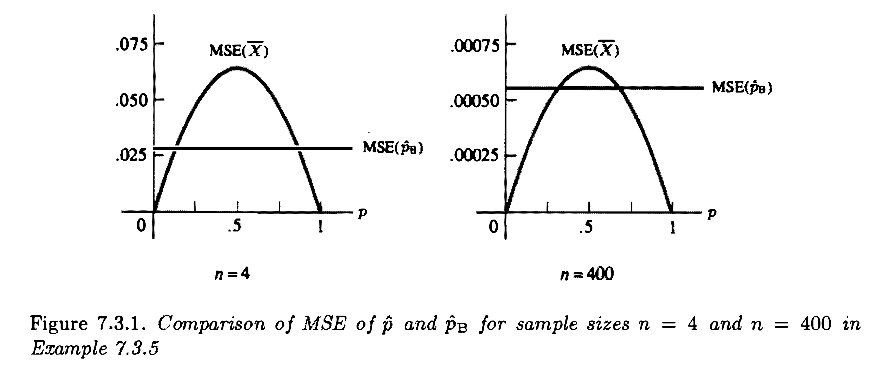

```{r setup, include=FALSE}
knitr::opts_chunk$set(echo = FALSE)
```


\newcommand{\rs}{X_1,X_2,\dots,X_n}
\newcommand{\on}{\operatorname}
\newcommand{\enter}{\vspace{0.1in}}
\newcommand{\ds}{\displaystyle}
\renewcommand{\bar}{\overline}
\newcommand{\N}{\text{N}}
\renewcommand{\epsilon}{\varepsilon}
\newcommand{\R}{\mathbb{R}}
\newcommand{\Ss}{\mathcal{S}}
\newcommand{\X}{\mathcal{X}}
\newcommand{\T}{\mathcal{T}}
\newcommand{\E}{\on{E}}
\newcommand{\var}{\on{Var}}
\newcommand{\MSE}{\on{MSE}}
\renewcommand{\vec}{\underline}
\newcommand{\asim}{\stackrel{a}{\sim}}
\renewcommand{\mathbf}{\vec}
<!-- \renewcommand{\mathcal}{\mathscr} -->


# AGENDA

\vspace{0.1in}

-  Wrap up discussions of the Bayesian approach to Statistics

\vspace{0.1in}

-  Methods of evaluating estimators


\vspace{0.1in}

-  Cramér-Rao Lower Bound


---


# Review: Bayesian approach to statistics


- The parameter $\theta$ is considered a random variable. Consider a **prior distribution**  for $\theta$ before observing any data. \vfill


- After drawing a sample find the likelihood function for $\theta$, and use Bayes' Rule to update the prior with the  likelihood function to get the \textbf{posterior distribution}:
$$
\begin{aligned}
\pi(\theta \mid \mathbf{x})  = \frac{f(\mathbf{x},\theta)}{m(\mathbf{x})} = \frac{f(\mathbf{x} \mid \theta)\pi(\theta)}{m(\mathbf{x})}
 \propto f(\vec x \mid \theta) \pi(\theta),
\end{aligned}
$$
where $m(\mathbf{x})$ is the marginal distribution of $\mathbf{X}$:
$$m(\mathbf{x})=\int{f(\mathbf{x} \mid \theta)\pi(\theta)\,d\theta}.$$


- The posterior distribution combines information from prior and likelihood. 


- One Bayesian point estimator of $\theta$ is given by the posterior mean $E(\theta \mid \vec X)$ (can also use posterior median, posterior mode, etc.)  

---


**Example (Binomial Bayes estimation):** Let $\rs\sim\operatorname{iid~Bernoulli}{(p)}$, and let
$\ds Y =\sum_{i=1}^n{X_i}$. Then $Y\sim\operatorname{binomial}(n,p)$.  Assume the prior distribution on $p$ to be $\operatorname{beta}(\alpha,\beta)$. 
\enter

The posterior distribution of $p$ is 
$$
p \mid Y \sim \on{Beta}(y + \alpha, n - y + \beta)
$$
The posterior mean is:
$$
\begin{aligned}
\hat{p}_B &= \E(p \mid Y) \\
&= \frac{y + \alpha}{n + \alpha + \beta} \\
&= \left(\frac{n}{n + \alpha + \beta}\right) \underbrace{\left(\frac{y}{n}\right)}_{=\text{sample mean}} + \left(\frac{\alpha+\beta}{n + \alpha + \beta}\right) \underbrace{\left(\frac{\alpha}{\alpha+\beta}\right)}_{=\text{prior mean}}
\end{aligned}
$$

---

# Conjugate Family

**Definition:** Let $\mathcal{F}$ denote the class of pdfs or pmfs $f(x \mid \theta)$, indexed by $\theta$. A class $\Pi$ of prior distributions is a \textbf{conjugate family} for $\mathcal{F}$ if the posterior distribution is in the class $\Pi$ for all $f\in\mathcal{F}$, all priors in $\Pi$, and all $x\in\mathcal{X}$.

\vfill

- The beta family is conjugate for the binomial family, which is why it was chosen as the prior distribution in the previous example.

\vfill

- the gamma family is conjugate for the Poisson family.

\vfill

- the normal family is its own conjugate.

---

**Example (Normal Bayes Estimator):** Let $X \sim \on{N}(\theta, \sigma^2)$, and suppose that the prior distribution on $\theta$ is $\N(\mu, \tau^2)$ where $\sigma^2$, $\mu$ and $\tau^2$ are all known.

\enter


The posterior distribution of $\theta$ is also normal (Exercise 7.22; Homework) with
$$
\E(\theta \mid x) = \frac{\tau^2}{\sigma^2 + \tau^2} x + \frac{\sigma^2}{\sigma^2 + \tau^2} \mu = \frac{1/\sigma^2}{1/\sigma^2 + 1/\tau^2} x + \frac{1/\tau^2}{1/\sigma^2 + 1/\tau^2} \mu
$$
and
$$
\var (\theta \mid x) = \frac{\sigma^2 \tau^2}{\sigma^2 + \tau^2} = \frac{1}{1/\sigma^2 + 1/\tau^2}
$$

Using the posterior mean, a Bayes point estimator is given by $\E(\theta \mid X)$.

\enter

Note that the Bayes estimator is again a linear combination of prior and sample means.

---


# Method of Evaluating Estimators

- There may exist multiple estimators for the same problem, obtained from different approaches, e.g., method of moments, maximum likelihood, Bayesian approach etc.


- We want to compare these estimators and possibly obtain  the "best" estimator.


\vfill


**Definition:**  The \textbf{mean squared error (MSE)} of an estimator $W$ of a parameter $\theta$ is the function of $\theta$ defined by
$$\MSE = \MSE_{\theta}(W) = \E_{\theta}\left[(W-\theta)^2\right].$$

Note: 
\textbf{mean absolute error}, defined as
$$\E_{\theta}\left[|W-\theta|\right],$$
is an alternative for measuring the performance of an estimator.

---

**Definition:** The \textbf{bias} of a point estimator $W$ of a parameter $\theta$ is the difference between the expected value of $W$ and $\theta$; that is,
$$\operatorname{Bias}_{\theta}(W)=\E_{\theta}(W)-\theta.$$
An estimator whose bias is identically equal to $0$ *as a function of $\theta$* is called \textbf{unbiased} and satisfies $\E_{\theta}(W)=\theta$ for all $\theta$.

\enter

Note that
$\ds{\MSE=\E_{\theta}\left[(W-\theta)^2\right]=\var_{\theta}(W)+\left[\operatorname{Bias}_{\theta}(W)\right]^2}$


\enter
\enter
\enter

- For an unbiased estimator, we have
$$\MSE =\E_{\theta}\left[(W-\theta)^2\right]=\var_{\theta}(W)$$

- Unbiasedness is a good property for an estimator to have, but it can be misleading.
  
  * Modern statistical methods for high-diemensional data often trades unbiasedness for a reduced variance ("bias-variance tradeoff") to achieve an estimator with smaller MSE.


---


**Example:** Let $\rs\sim\operatorname{iid~Bernoulli}(p)$. Let $W=X_1$. Since $E(W)=p$, $W$ is unbiased, but doesn't use all the data. Note that for $W$,
$$\MSE(W)=\var(W)=p(1-p).$$

\vfill


**Example:** Let $\rs\sim\operatorname{iid~N}(\mu,\sigma^2)$. Since $\E(\overline{X})=\mu$ and $\E(S^2)=\sigma^2$, $\overline{X}$ and $S^2$ are unbiased for $\mu$ and $\sigma^2$.

Thus, the mean squared errors (see Thms. 5.2.6 and 5.3.1) are
$$
\begin{aligned}
\MSE(\overline{X}) & = \var(\overline{X})  = \frac{\sigma^2}{n}\\[.5em]
\MSE(S^2) & = \var(S^2) = \frac{2\sigma^4}{n-1}
\end{aligned}
$$

---

Recall the MLE for $\sigma^2$ is $\hat{\sigma}^2=\frac{n-1}{n}S^2$.

\enter

Note that 
$$
\begin{aligned}
\E\left(\hat \sigma^2\right) &= \E\left(\frac{n-1}{n}S^2\right) =  \frac{n-1}{n}\sigma^2 \implies \left[\on{Bias}\left(\hat\sigma^2\right)\right]^2 = \frac{\sigma^4}{n^2} \\
\var\left(\hat \sigma^2\right) &= \var\left(\frac{n-1}{n}S^2\right) = \frac{2(n-1)\sigma^4}{n^2}
\end{aligned}
$$
\enter

Therefore 
$$
\MSE\left(\hat \sigma^2\right) = \var \left(\hat \sigma^2\right) + \left[\on{Bias}\left(\hat\sigma^2\right)\right]^2 = \frac{2n - 1}{n^2} \sigma^4
$$
Note that 
$$
\frac{2n - 1}{n^2} = \frac{2}{n} - \frac{1}{n^2} < \frac{2}{n-1}
$$

\enter

which implies $\ds \MSE\left(\hat \sigma^2\right) < \MSE\left(S^2\right)$. 


---

**Example (7.3.5; Contd.):** Let $\rs \sim \operatorname{iid~Bernoulli}(p)$. Then $Y=\sum_{i=1}^n{X_i}\sim\operatorname{binomial}(n,p)$.
Recall that we have developed two estimators for $p$, the MLE and the Bayes estimator:
$$
\begin{aligned}
\hat{p} & = \frac{Y}{n}=\overline{X}\\[.5em]
\hat{p}_B & = \frac{Y+\alpha}{\alpha+\beta+n}
\end{aligned}
$$

We have 
$$
\begin{aligned}
\MSE_p(\hat{p}) &= \frac{p(1-p)}{n}\\
\MSE_p(\hat{p}_B) &= \var_p(\hat p_B) + (\on{Bias}_p(\hat p_B))^2 \\
&= \var_p \left( \frac{Y + \alpha}{\alpha + \beta + n} \right) + \left[\E_p \left(\frac{Y + \alpha}{\alpha + \beta + n}\right) - p \right]^2 \\
&= \frac{np(1-p)}{(\alpha + \beta + n)^2} + \left(\frac{np + \alpha}{\alpha + \beta + n} - p\right)^2
\end{aligned}
$$


---

Choosing $\alpha=\beta=\frac{\sqrt{n}}{2}$ makes the MSE of $\hat{p}_B$ constant as a function of $p$. Under this choice the MSEs are as follows:
$$
\begin{aligned}
\MSE(\hat{p}) &= \quad \frac{p(1-p)}{n}\\[.5em]
\MSE(\hat{p}_B) &= \quad \frac{n}{4(n+\sqrt{n})^2}
\end{aligned}
$$


---

# Finding the "Best" Estimator

- Depends on what ``best" means.

- Depends on the value of the parameter.

- There may be situations where a biased estimator (like $\hat{p}_B$) may be better.

- We first define ``best" in relation to the variance of an unbiased estimator.

\vfill


**Definition:** An estimator $W^*$ is a \textbf{best unbiased estimator} of $\tau(\theta)$ if it satisfies the following:

(a) $W^*$ is unbiased, i.e., $\E_{\theta}(W^*)=\tau(\theta)$ for all $\theta$; and\vskip .1in

(b) among all unbiased estimators, the variance (or MSE) of $W^*$ is a minimum, i.e., for any other estimator $W$ with $\E_{\theta}(W)=\tau(\theta)$, we have
$$\MSE(W^*)=\var_{\theta}(W^*)\leq\var_{\theta}(W)=\MSE(W)$$
for all $\theta$. $W^*$ may also be called a \textbf{uniform minimum variance unbiased estimator (UMVUE)} of $\tau(\theta)$.

---

# Cramér-Rao Inequality


- It is usually hard to determine if a UMVUE exists.

- However, there is a lower bound on the variance of any unbiased estimator.

- So if we can find an unbiased estimator that achieves this lower bound, we know it must be UMVUE.

\vfill

## Theorem (7.3.9; Cramér-Rao Lower Bound)

Let $\mathbf{X}=(\rs)$ have pdf $f(\mathbf{x} \mid \theta)$, and let $W(\mathbf{X})$ be any estimator satisfying
\vskip .05in
\begin{enumerate}[(a)]
\item $\ds{\frac{d}{d\theta}\E_{\theta}\left[W(\mathbf{X})\right]=\int_{\mathcal{X}}{\frac{\partial}{\partial\theta}\left[W(\mathbf{x})f(\mathbf{x} \mid \theta)\right]\,d\mathbf{x}}}$; and\vskip .1in
\item $\var_{\theta}\left[W(\mathbf{X})\right]<\infty$.
\end{enumerate}
\vskip .2in
Then
$$\var_{\theta}(W(\mathbf{X}))\geq\frac{\left[\frac{d}{d\theta}\E_{\theta}\left[W(\mathbf{X})\right]\right]^2}{\E_{\theta}\left[\left[\frac{\partial}{\partial\theta}\log{f(\mathbf{X} \mid \theta)}\right]^2\right]}.$$


---

**Proof:** Note that for any two random variables $U$ and $V$
$$
[\on{Cov}(U, V)]^2 \stackrel{\text{Cauchy-Schwarz}}{\leq} \var(U) \var(V) \implies \var(U) \geq \frac{[\on{Cov}(U, V)]^2}{\var(V)}
$$
Take $U \equiv W(\vec X)$ and $V \equiv \frac{\partial}{\partial\theta}\log{f(\mathbf{X} \mid \theta)}$. Note that
$$
\E(V) = \E_\theta\left(\frac{\partial}{\partial\theta}\log{f(\mathbf{X} \mid \theta)}\right) = \int_{\mathcal{X}}   \frac{\partial}{\partial\theta}\log{f(\mathbf{x} \mid \theta)} \ f(\vec x \mid \theta) \ d \vec x = \frac{\partial}{\partial\theta} E(1) = 0
$$
So, $\on{Cov}(U, V) = \E(U V)$ and $\var(V) = \E(V^2)$. Note that 
$$
\E(UV) = \int_{\mathcal{X}} W(\vec x) \ \frac{\partial}{\partial\theta} {f(\mathbf{x} \mid \theta)} \ d\vec x = \frac{d}{d\theta} \E_\theta \left( W(\vec X) \right)
$$
Therefore, combining we get
$$
\var_\theta (W(\vec X)) = \var (U) \geq \frac{[\on{Cov}(U, V)]^2}{\var(V)} = \frac{[\E(UV)]^2}{\E(V^2)} = \frac{\left[\frac{d}{d\theta}\E_{\theta}\left[W(\mathbf{X})\right]\right]^2}{\E_{\theta}\left[\left[\frac{\partial}{\partial\theta}\log{f(\mathbf{X} \mid \theta)}\right]^2\right]}
$$


---

## Corollary: Cramér-Rao Lower Bound, iid case

If the assumptions of Theorem 7.3.9 are satisfied, and, additionally, if $\rs$ are $\operatorname{iid}$ with pdf $f(x \mid \theta)$, then
$$\var_{\theta}(W(\mathbf{X}))\geq\frac{\left[\frac{d}{d\theta}\E_{\theta}\left[W(\mathbf{X})\right]\right]^2}{n\E_{\theta}\left[\left[\frac{\partial}{\partial\theta}\log{f(X_1 \mid \theta)}\right]^2\right]}.$$
**Proof:** Homework. See  p. 337 in the textbook.

\enter

\vfill

## Notes

- If $W(\mathbf{X})$ is unbiased for $\theta$, then the numerator is
$$\left[\frac{d}{d\theta}\E_{\theta}\left[W(\mathbf{X})\right]\right]^2=1.$$

- The denominator is a function of the density, not the data.


---

# Fisher Information

**Definition:** $\E_{\theta}\left[\left[\frac{\partial}{\partial\theta}\log{f(\mathbf{X} \mid \theta)}\right]^2\right]$ is called the \textbf{Fisher information} of the sample.


\enter
\vfill

## Lemma 7.3.11: Calculating the Fisher Information

If $f(x \mid \theta)$ satisfies
$$\frac{d}{d\theta}\E_{\theta}\left[\frac{\partial}{\partial\theta}\log{f(X \mid \theta)}\right]=\int_{\mathcal{X}}{\frac{\partial}{\partial\theta}\left[\left[\frac{\partial}{\partial\theta}\log{f(x \mid \theta)}\right]f(x \mid \theta)\right]\,dx}$$
(which is always true for an exponential family), then
$$\E_{\theta}\left[\left[\frac{\partial}{\partial\theta}\log{f(X \mid \theta)}\right]^2\right]=-\E_{\theta}\left[\frac{\partial^2}{\partial\theta^2}\log{f(X \mid \theta)}\right].$$

---

**Example:** Let $\rs\sim\operatorname{iid~gamma}(\alpha,\beta)$, and assume $\alpha$ is known.
Show that $W(\mathbf{X})=\frac{1}{\alpha}\overline{X}$ attains the Cramér-Rao lower bound for an unbiased estimator of $\beta$, and hence is UMVUE.

\enter

First note that $\ds \var_\beta(W(\vec X)) = \var_\beta\left(\frac{1}{\alpha}\overline{X}\right) = \frac{1}{\alpha^2} \var_\beta \left(\bar X\right) = \frac{\beta^2}{\alpha n}$

Now obtain the CR lower bound. We have $f(x \mid \beta) = \frac{1}{\Gamma(\alpha)\beta^\alpha} \  x^{\alpha-1}  e^{-x/\beta}$ which implies $\log f(x \mid \beta) = \log \Gamma(\alpha) - \alpha \log \beta + (\alpha-1) \log x - \frac{x}{\beta}$. Then
<!-- First calculate Fisher Information. We have -->
$$
\frac{\partial}{\partial\beta}\log{f(x \mid \beta)} = - \frac{\alpha}{\beta} + \frac{x}{\beta^2}; \quad
\frac{\partial^2}{\partial\beta^2}\log{f(x \mid \beta)} = \frac{\alpha}{\beta^2} - \frac{2x}{\beta^3}
$$
Therefore
$$
\E_{\beta}\left[\left[\frac{\partial}{\partial\beta}\log{f(X_1 \mid \beta)}\right]^2\right]=-\E_{\beta}\left[\frac{\partial^2}{\partial\beta^2}\log{f(X_1 \mid \beta)}\right] = \E_\beta \left[ \frac{2X_1}{\beta^3} - \frac{\alpha}{\beta^2} \right] = \frac{\alpha}{\beta^2}
$$
Of course, $W(\mathbf{X})=\frac{1}{\alpha}\overline{X}$ being unbiased for $\beta$ means $\frac{d}{d\beta}\E_{\beta}\left[W(\mathbf{X})\right] = 1$. Hence, the CR lower bound is (iid):
$$
\frac{\left[\frac{d}{d\beta}\E_{\beta}\left[W(\mathbf{X})\right]\right]^2}{n \E_{\beta}\left[\left[\frac{\partial}{\partial\beta}\log{f(X_1 \mid \beta)}\right]^2\right]} = \frac{1}{n \alpha/\beta^2} = \frac{\beta^2}{n \alpha} = \var_\beta(W(\vec X))
$$

---

**Example** Let $\rs\sim\operatorname{iid~uniform}(0,\theta)$. The assumptions in CR inequality does not hold (verify; see p. 340 in the textbook). We will show that there exists an unbiased estimator of $\theta$ whose variance is uniformly smaller than the CRLB.

\enter

Note that here $\frac{\partial}{\partial \theta} \log f(x \mid \theta) = - \frac{1}{\theta} \implies \E_{\theta}\left[\left[\frac{\partial}{\partial\theta}\log{f(X_1 \mid \theta)}\right]^2\right] = \frac{1}{\theta^2}$.

So, CR lower bound = $\ds \frac{\theta^2} {n}$.


Consider $Y = X_{(n)}$. $\ds f_Y(y) = n y^{n-1}/\theta^n$, $0<y<\theta$ so that
$$
E_\theta(Y) = \int_{0}^{\theta} \frac{ny^n}{\theta^n} \ dy =  \frac{n}{n+1} \ \theta \implies E_\theta \left(  \underbrace{\frac{n+1}{n} Y}_{=U} \right) = \theta
$$
i.e., $U$ is an unbiased estimator of $\theta$. We have
$$
\var_\theta \left( U \right) = \var_\theta \left( \frac{n+1}{n}  Y \right) = \frac{1}{n(n+2)} \theta^2 < \frac{1}{n} \theta^2
$$

\vfill

**NOTE:** In general, if the range of the pdf depends on the parameter, the Cramér-Rao Theorem will not be applicable.

---

# Attainment

- There is no guarantee that the bound given in the Cramér-Rao Inequality is sharp.  That is, our best unbiased estimator may not achieve the CRLB. \vfill

- Problem: when do we stop searching?

---

# Homework

-   Read p. $330-342$.

-   Exercises: TBA.

